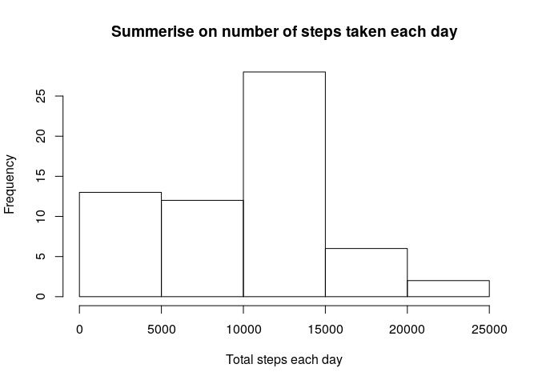
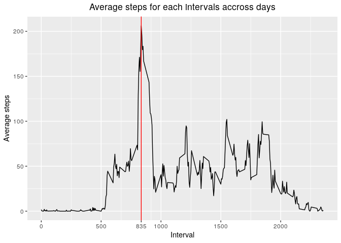
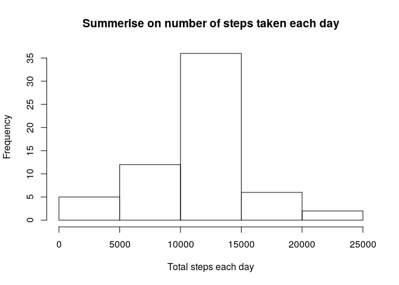
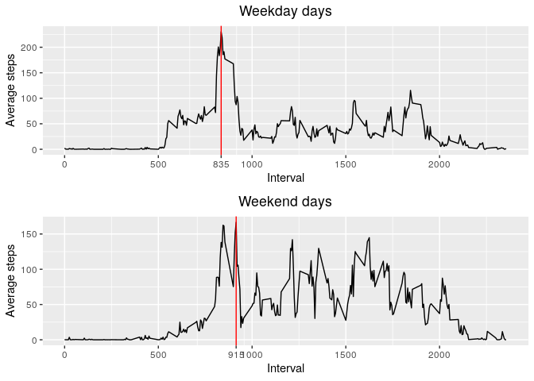

## Loading and preprocessing the data

```r
activity_data_path <- 'raw_data/activity.csv'
activity_data <- read.csv(activity_data_path)
```


## What is mean total number of steps taken per day?

```r
library(dplyr)
report_total_steps_per_day <- function(other_activity_data) {
    total_steps_per_day <- other_activity_data %>%
                            dplyr::group_by(date) %>%
                            dplyr::summarise(total_steps = sum(steps, na.rm = T))
    
    hist(total_steps_per_day$total_steps,
        xlab = 'Total steps each day',
        main = 'Summerise on number of steps taken each day')
    
    average_steps <- as.integer(mean(total_steps_per_day$total_steps))
    median_steps <- as.integer(median(total_steps_per_day$total_steps))
    return(c(average_steps, median_steps))
}
mean_and_median <- report_total_steps_per_day(activity_data)
```

<!-- -->
  
- Mean and median of total steps each days:  

```r
print(mean_and_median)
```

```
## [1]  9354 10395
```

## What is the average daily activity pattern?

```r
library(ggplot2)
get_average_steps_per_interval_on_day <- function (other_activity_data) {
    other_activity_data %>%
        group_by(interval) %>%
        dplyr::summarise(
            average_steps = mean(steps, na.rm = T)
        )
}
daily_activity_pattern <- function (other_activity_data, my_title) {
    average_steps_per_interval_on_day <- get_average_steps_per_interval_on_day(other_activity_data)
    
    max_points <- average_steps_per_interval_on_day$interval[
        average_steps_per_interval_on_day$average_steps ==
            max(average_steps_per_interval_on_day$average_steps)
    ]
    gap <- 500
    
    breaks <- seq(0, max(average_steps_per_interval_on_day$interval), gap)
    breaks <- c(breaks, max_points)
    breaks <- breaks[order(breaks)]
    plot_labels <- as.character(breaks)
    
    with(average_steps_per_interval_on_day,
        return(ggplot2::ggplot(average_steps_per_interval_on_day, aes(x = interval, y = average_steps)) +
            geom_line() +
            geom_vline(xintercept = interval[average_steps == max(average_steps)], color = 'red') +
            scale_x_continuous(breaks = breaks, labels = plot_labels, name = 'Interval') +
            ylab('Average steps') +
            ggtitle(my_title) +
            theme(plot.title = element_text(hjust = 0.5))
        )
    )
}
my_plot_daily_activity_pattern <- daily_activity_pattern(activity_data, 'Average steps for each intervals accross days')
my_plot_daily_activity_pattern
```

<!-- -->


## Imputing missing values
- Number of missing values in data set is:  

```r
sum(is.na(activity_data$steps) | is.na(activity_data$date) | is.na(activity_data$interval))
```

```
## [1] 2304
```
- Strategy for filling NA values: Fill them with mean steps of that interval accross days. If all of them are NAs, then it will be 0.  

```r
### Average steps was calculated and stored in `average_steps_per_interval_on_day`
average_steps_per_interval_on_day <- get_average_steps_per_interval_on_day(activity_data)
get_mean_on_interval <- function (interval) {
    for (i in 1:nrow(average_steps_per_interval_on_day)) {
        if (average_steps_per_interval_on_day$interval[i] == interval) {
            return(average_steps_per_interval_on_day$average_steps[i])
        }
    }
    return(0)
}

non_na_activity_data <- activity_data
for (i in 1:nrow(activity_data)) {
    if (is.na(activity_data$steps[i])) {
        non_na_activity_data$steps[i] <- get_mean_on_interval(activity_data$interval[i])
    }
}

head(non_na_activity_data)
```

```
##       steps       date interval
## 1 1.7169811 2012-10-01        0
## 2 0.3396226 2012-10-01        5
## 3 0.1320755 2012-10-01       10
## 4 0.1509434 2012-10-01       15
## 5 0.0754717 2012-10-01       20
## 6 2.0943396 2012-10-01       25
```
- Histogram of new data set:  

```r
other_mean_and_median <- report_total_steps_per_day(non_na_activity_data)
```

<!-- -->
  
- Compare to mean and median of the original data set:  

```r
identical(mean_and_median, other_mean_and_median)
```

```
## [1] FALSE
```
- Filling NAs increase both mean and median of total of steps each day.  

## Are there differences in activity patterns between weekdays and weekends?  
- Create new factor on type of day (weekend, weekday)  

```r
my_weekend <- factor('weekend')
my_weekday <- factor('weekday')

Sys.setlocale("LC_TIME", "en_US.UTF-8")
```

```
## [1] "en_US.UTF-8"
```

```r
non_na_activity_data$day_type <- sapply(non_na_activity_data$date, function (my_date_str) {
    my_date <- as.POSIXlt(my_date_str)
    if (weekdays(my_date) %in% c('Sunday', 'Saturday')) {
        return(my_weekend)
    }
    return(my_weekday)
})

table(non_na_activity_data$day_type)
```

```
## 
## weekday weekend 
##   12960    4608
```

- Make plots for weekday days and weekend ones  

```r
# install.packages('gridExtra')
library(gridExtra)

my_plot_weekend_activity_pattern <- daily_activity_pattern(
    subset(non_na_activity_data, as.character(non_na_activity_data$day_type) == as.character(my_weekend)),
    'Weekend days'
)
my_plot_weekday_activity_pattern <- daily_activity_pattern(
    subset(non_na_activity_data, as.character(non_na_activity_data$day_type) == as.character(my_weekday)),
    'Weekday days'
)
grid.arrange(my_plot_weekday_activity_pattern, my_plot_weekend_activity_pattern, ncol = 1, nrow = 2)
```

<!-- -->
